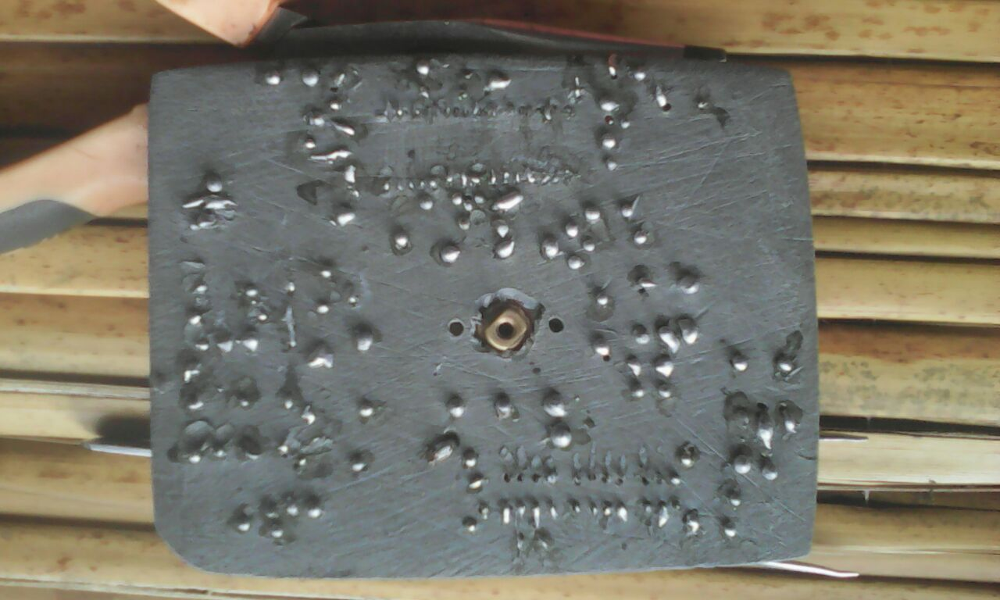
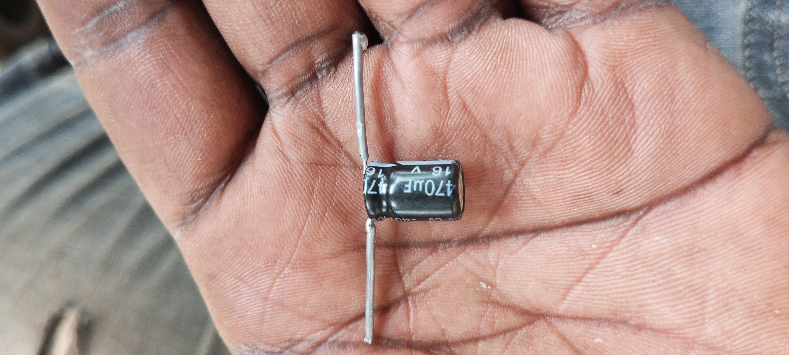
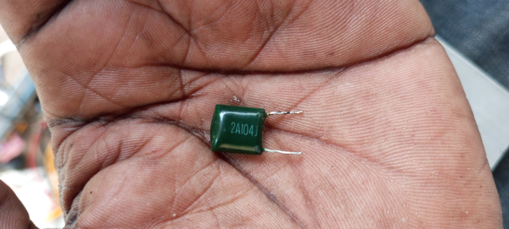

# an-fm-radio-transmitter
Provided materials and circuit boards but in this case using locally available material to creat personal circuit board.

# Tools.
- soldering iron
- multimetre
- screw drivers(radio set)
- blade
- solder sucker
# skills
In order to carry out this project;
- one must have a skill in soldering

- familiar with radio wiring
- familiar with electric transmission components such as capacitors, resistors,coils, ceramic capacitors etc 

